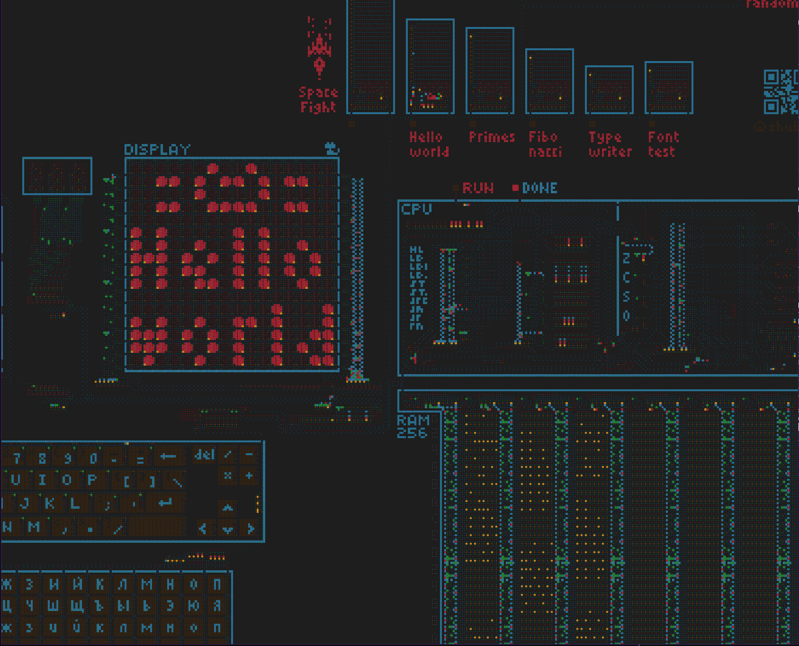
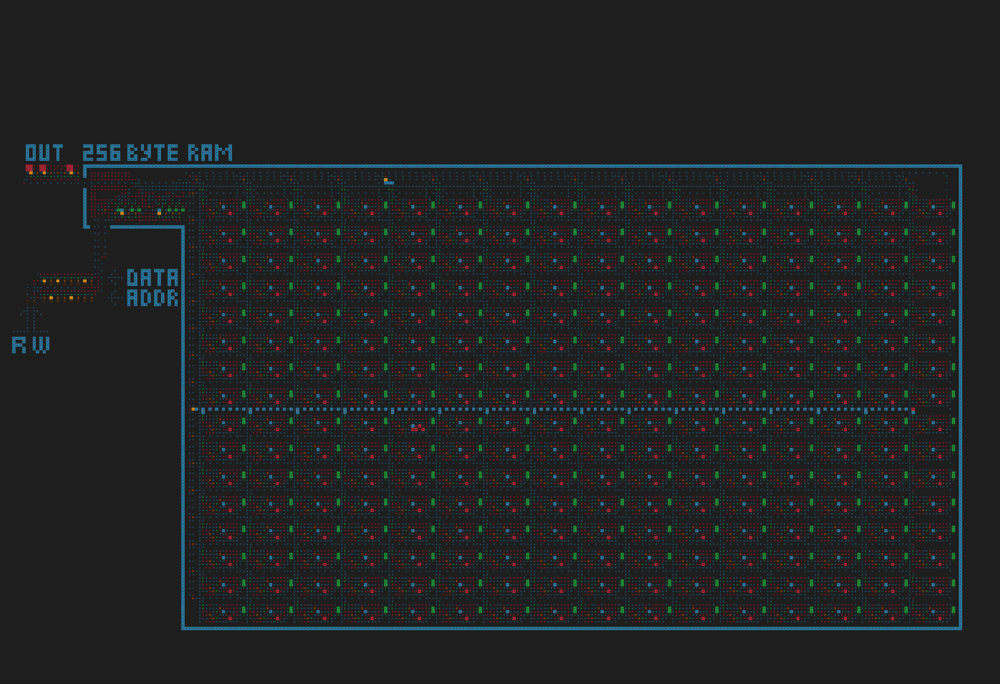

## BLogicArrows

BlogicArrows - is an offline open-source parody of the [Logic Arrows](https://logic-arrows.io)

The project was created primarily because I personally wanted an offline and comfortable version
of this game. I also wanted to give people who are interested in adding something new or
experimenting with the game an opportunity to work with an open-source version

This was written this using C++ and OpenGL with the aim to improve the performance of original
version, i didn't use any special ways to make this completely blazingly fast but at least it turned
out quite fast version

The game probably has some bugs. It hasn’t been tested enough yet. If you find anything, let me know

### Examples

<table>
  <tr>
    <td align="center">
      
      <br>
      <a href="https://github.com/chubrik/LogicArrows/tree/main/ru/computer-v1"><b>Chubrik's first computer</b></a>
    </td>
    <td align="center">
      
      <br>
      <a href="https://logic-arrows.io/map-AlgRjKhX"><b>My 256 byte RAM</b></a>
    </td>
  </tr>
</table>
<p>

### Usage
``
./bla [name of file that you want to open or create]
``

**There is no autosave, be careful**


### Build
```bash
git clone https://github.com/floadsa/BLogicArrows.git

cd BLogicArrows
cd build

./make

# you can adjust compilation options inside this file
# for example -O0 for debug or set -O3 for the fastest perfomance
```
### Controls

- Middle mouse button - camera movement
- Left mouse button - apply a brush
- W A S D - rotates the brush
- R - eraser
- Q - dropper
- E - selection
- C - copy selection
- X - cut selection
- Backspace - delete selection
- V - past selection
- Z - undo
- < > - adjusting delay between ticks(default 100 ms)
- Space - stop simulation
- Ctrl+S - save file

### Plans
Minor changes and bug fixes in the future
